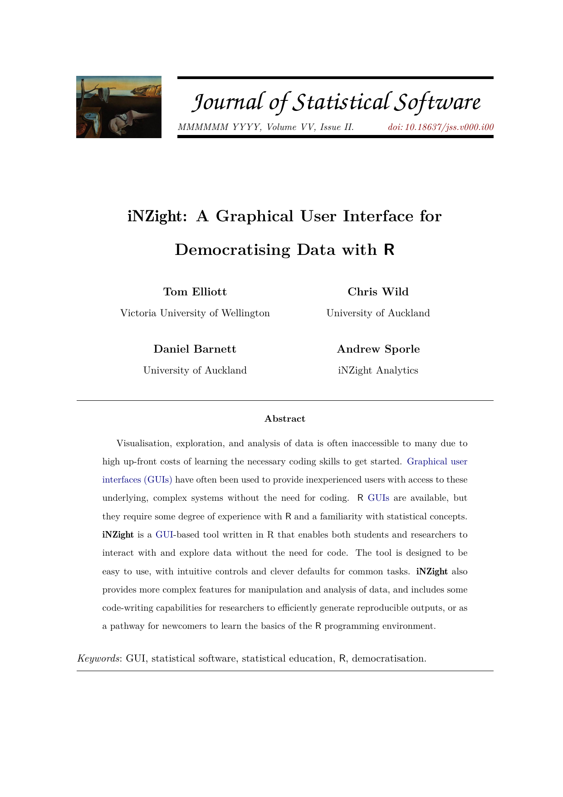
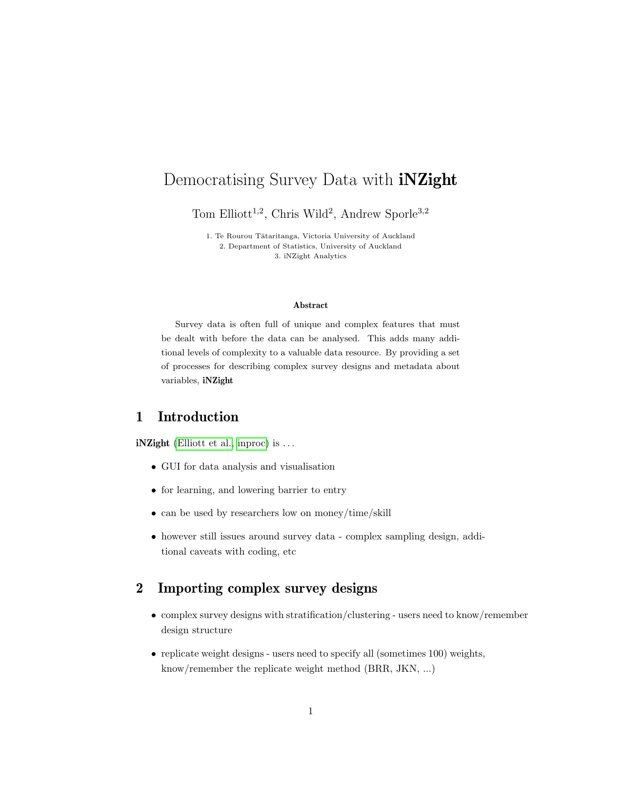

# iNZight papers

Code repository for iNZight articles.

Automatic compilation on Github assumes there’s a `Makefile` in each
subdirectory.

<table>

<tr>

<td>

</td>

<td>

<strong><a href='2021_inzight_jss/index.pdf'>iNZight: A Graphical User
Interface for Data Visualisation and Analysis through
R</a></strong> Tom Elliott and Chris Wild and Daniel Barnett and
Andrew Sporle

</td>

</tr>

<tr>

<td>

</td>

<td>

<strong><a href='202x_democratising-surveys/index.pdf'>Democratising
Survey Data with iNZight</a></strong> Tom Elliott and Chris Wild and
Andrew Sporle

</td>

</tr>

</table>
