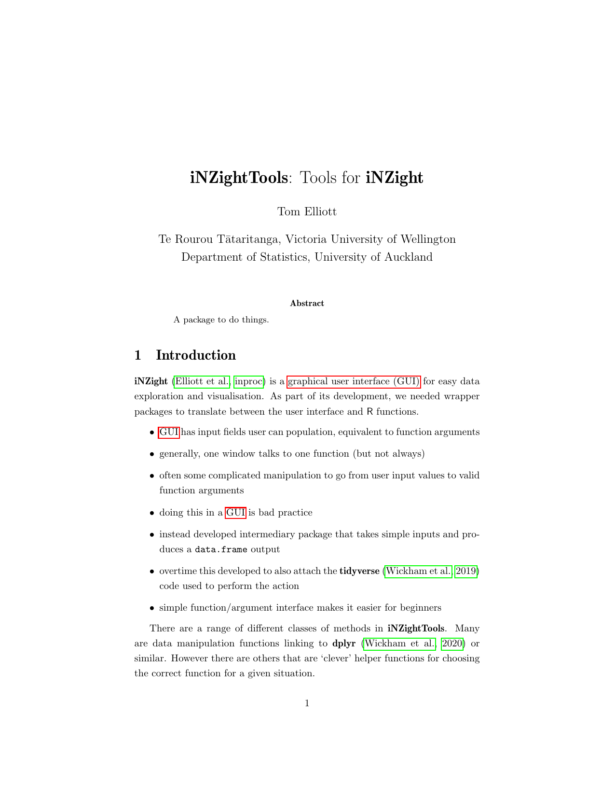

# iNZight papers

Code repository for iNZight articles.

Automatic compilation on Github assumes there’s a `Makefile` in each
subdirectory.

<table>

<tr>

<td>

</td>

<td>

<strong><a href='2021_inzight_jss/index.pdf'>: A Graphical User
Interface for Data Visualisation and Analysis through
</a></strong> Tom Elliott \[1,2\]

</td>

</tr>

<tr>

<td>

</td>

<td>

<strong><a href='2021_inzight_jss/index.pdf'>: A Graphical User
Interface for Data Visualisation and Analysis through
</a></strong> Chris Wild \[2\]

</td>

</tr>

<tr>

<td>

</td>

<td>

<strong><a href='2021_inzight_jss/index.pdf'>: A Graphical User
Interface for Data Visualisation and Analysis through
</a></strong> Daniel Barnett \[2\]

</td>

</tr>

<tr>

<td>

</td>

<td>

<strong><a href='2021_inzight_jss/index.pdf'>: A Graphical User
Interface for Data Visualisation and Analysis through
</a></strong> Andrew Sporle \[3,2\]

</td>

</tr>

<tr>

<td>

</td>

<td>

<strong><a href='202x_democratising-surveys/index.pdf'>Democratising
Survey Data with </a></strong> Tom Elliott \[1,2\]

</td>

</tr>

<tr>

<td>

</td>

<td>

<strong><a href='202x_democratising-surveys/index.pdf'>Democratising
Survey Data with </a></strong> Chris Wild \[2\]

</td>

</tr>

<tr>

<td>

</td>

<td>

<strong><a href='202x_democratising-surveys/index.pdf'>Democratising
Survey Data with </a></strong> Andrew Sporle \[3,2\]

</td>

</tr>

<tr>

<td>

</td>

<td>

<strong><a href='202x_iNZightTools/index.pdf'>: Tools for
</a></strong> Tom Elliott \[1,2\]

</td>

</tr>

</table>
